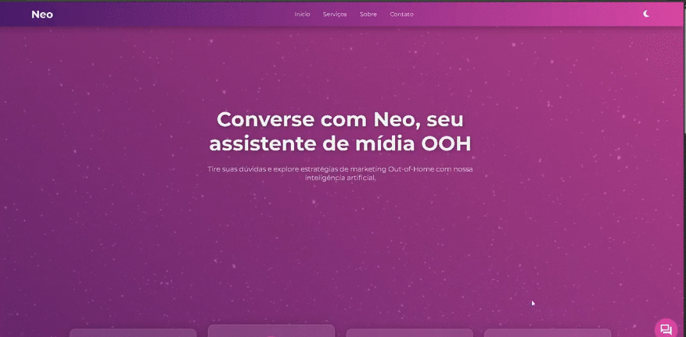

# 🤖 AI OOH Segmentation Assistant (NEOOH)

Assistente inteligente baseado em LLM para recomendação estratégica de mídia OOH, com interface web e deploy em ambiente cloud utilizando Google Cloud Platform.

  

---

## 🎯 Problema

A escolha de canais de mídia OOH (Out Of Home) ainda é, em muitos casos, baseada em decisões subjetivas.

Empresas precisam considerar múltiplas variáveis como público-alvo, orçamento, localização e objetivo da campanha — o que torna o processo complexo e pouco escalável.

---

## 💡 Solução

Desenvolvi um agente de IA capaz de:

- Interpretar briefing de campanhas em linguagem natural
- Processar dados estruturados e não estruturados
- Recomendar automaticamente o melhor segmento de mídia OOH
- Gerar uma análise SWOT completa e orientada por dados

---

## 🖥️ Interface da Aplicação

A aplicação conta com uma interface web para interação com o agente:

- Input de dados da campanha
- Chat com o agente
- Respostas estruturadas com análise estratégica

---

## 🏗️ Arquitetura

A solução foi construída com arquitetura baseada em cloud:

- **Frontend (Python)** → Interface do usuário
- **Backend (Docker + Cloud Run)** → API do agente
- **Vertex AI / LLM** → processamento de linguagem natural
- **Data Store (RAG)** → base de conhecimento por segmentos
- **BigQuery** → dados estruturados
- **Firestore** → histórico de conversas

### 🔄 Fluxo da aplicação

Usuário → Interface Web → API (Cloud Run) → LLM → RAG + BigQuery → Resposta (SWOT)

---

## 🐳 Deploy

A aplicação foi containerizada com Docker e implantada via Google Cloud Run.

### Etapas:

1. Containerização da aplicação
2. Configuração de serviços no GCP
3. Deploy no Cloud Run
4. Integração com serviços de dados e IA

---

## 🛠️ Tecnologias

- Python
- Docker
- Google Cloud Platform
  - Cloud Run
  - Vertex AI
  - BigQuery
  - Firestore
- LLM (modelo generativo)
- Arquitetura RAG

---

## ⚙️ Funcionalidades

- Chat inteligente com agente de IA
- Recomendação de segmento OOH
- Geração automática de análise SWOT
- Integração com base de dados
- Simulação de cenários alternativos

---

## 📊 Exemplo de uso

Entrada:
"Campanha de branding, público feminino 25-45, classe A, orçamento R$150k, nacional"

Saída:
- Segmento recomendado
- Análise SWOT completa
- Sugestão alternativa

---

## 📚 Aprendizados

- Construção de agentes com LLM
- Arquitetura RAG na prática
- Deploy de aplicações com Docker + Cloud Run
- Integração de IA com dados estruturados
- Design de prompts estratégicos

---

## ⚠️ Limitações

- Dependência da qualidade dos dados
- Necessidade de ajustes finos no prompt
- Custo de execução em cloud

---

## 🚀 Melhorias futuras

- Autenticação de usuários
- Dashboard de métricas
- Otimização de custo

---

## ☁️ Observação

Projeto desenvolvido simulando um ambiente real de produção, com foco em escalabilidade, uso de IA e arquitetura em cloud.

---
